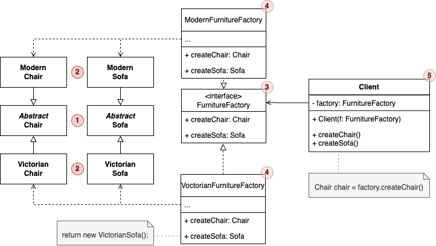

# 抽象工厂模式
抽象工厂模式能创建一系列相关的对象，而无需指定其具体类。

## 适用场景：
1. 需要创建多个相关对象家族的场景，例如跨平台UI、家具套装、游戏场景。
2. 强调产品兼容性的时候，例如同一个品牌的电器，同一主题的UI。
3. 系统需要独立于产品的创建过程，例如代码需要支持多种数据库访问，则可以创建兼容的Connection、Command等对象，切换数据库时只需要更换工厂（MySQLFactory改为OracleFactory），客户端代码无需改动。
    ```java
    // 抽象产品：数据库连接
    interface Connection {
    void connect();
    }
    
    // 具体产品：MySQL连接
    class MySQLConnection implements Connection {
    public void connect() { System.out.println("MySQL连接建立"); }
    }
    
    // 抽象工厂
    interface DatabaseFactory {
    Connection createConnection();
    }
    
    // 具体工厂：MySQL工厂
    class MySQLFactory implements DatabaseFactory {
    public Connection createConnection() { return new MySQLConnection(); }
    }
    ```

## 代码样例UML图：


## 如果未使用抽象工厂设计模式，则样例代码会变成：
```java
// 客户端代码直接实例化具体类
public class FurnitureShop {
    public static void main(String[] args) {
        // 创建一套现代风格家具（手动组合）
        Chair modernChair = new ModernChair();
        Sofa modernSofa = new ModernSofa();
        CoffeeTable modernTable = new ModernCoffeeTable();

        // 创建一套维多利亚风格家具（容易混搭错误！）
        Chair victorianChair = new VictorianChair();
        Sofa victorianSofa = new ModernSofa(); // 错误：混搭了现代沙发！
        CoffeeTable victorianTable = new VictorianCoffeeTable();
    }
}

// 具体产品类（省略接口）
class ModernChair {
    public void sitOn() { System.out.println("Modern chair"); }
}
class VictorianChair {
    public void sitOn() { System.out.println("Victorian chair"); }
}
// ...其他具体类（ModernSofa, VictorianSofa等）类似定义
```

### 存在问题：
1. 对象兼容难以保证：
    * 混搭风险：客户端可能错误组合不同风格的对象。
    * 依赖具体类：客户端代码直接调用 ```new ModernChair()```，与具体类高度耦合。
2. 难以扩展：
    * 新增风格成本高：如果要增加”装饰风艺术“风格，需要修改所有客户端代码中实力化的地方。
    * 违反开闭原则：新增风格都要修改现有代码。
3. 重复代码：
   * 重复创建逻辑：每次构建一套家具都需要手动实例化多个对象（Chair、Sofa、CoffeeTable）。
4. 难以维护：
   * 创建逻辑分散：如果“Modern”风格家具的构造函数需要修改，则客户端所有调用处都要同步更改。

## 使用了抽象工厂模式后的优势：
1. 强制兼容性：工厂确保同一家族的对象风格一致。
2. 解耦客户端：客户端只依赖抽象接口（```FurnitureFactory```、```Chair```等）。
3. 易于扩展：新增风格之需要添加新工厂和产品类，无需修改客户端代码。