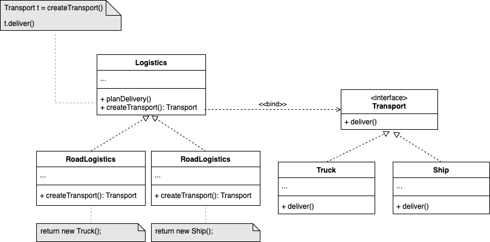

# 工厂方法模式

工厂方法模式的核心是**将「创建什么」的决定权交给了子类**，从而在保持灵活性的同时减少耦合。
## 适用场景：
1. 对象创建逻辑可能会发生变化的时候，例如物流有多种运输方式、支付方式扩展等场景；
2. 需要支持多种子类的时候，例如跨平台UI组建、游戏敌人类型等场景；
3. 新增类型时不需要修改现有代码，符合开闭原则，例如新增日志存储方法、新增物流运输方式等场景。

## 代码样例UML图：


## 如果未使用工厂方法设计模式，则样例代码会变成：
```java
// 具体运输类
class Truck {
    public String deliver() {
        return "Land delivery (Truck)";
    }
}

class Ship {
    public String deliver() {
        return "Sea delivery (Ship)";
    }
}

// 客户端代码直接依赖具体类
public class LogisticsApp {
    public static void main(String[] args) {
        // 直接创建卡车运输（紧耦合）
        Truck truck = new Truck();
        System.out.println("Delivery: " + truck.deliver());

        // 未来新增海运时，需要修改客户端代码
        Ship ship = new Ship();
        System.out.println("Delivery: " + ship.deliver());
    }
}
```

### 存在问题：
1. 紧耦合：客户端代码直接依赖 ```Truck``` 和 ```Ship``` 的具体实现。
2. 违反开闭原则：新增运输方式（如 Airplane）必须修改客户端代码。
3. 重复代码：每次创建运输对象都需要重复调用 ```new``` 和 ```deliver()```。

### 使用了工厂方法后的优势：
1. 解耦：客户端只接触 ```Logistics``` 和 ```Transport``` 抽象。
2. 可扩展：新增 Airplane 之需要添加新工厂，不修改旧代码。
3. 单一职责：每个类只负责自己的逻辑。